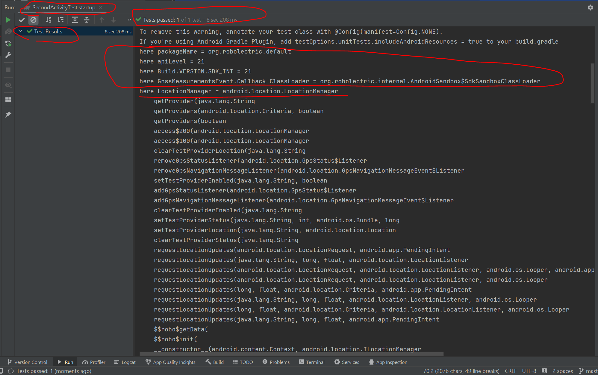
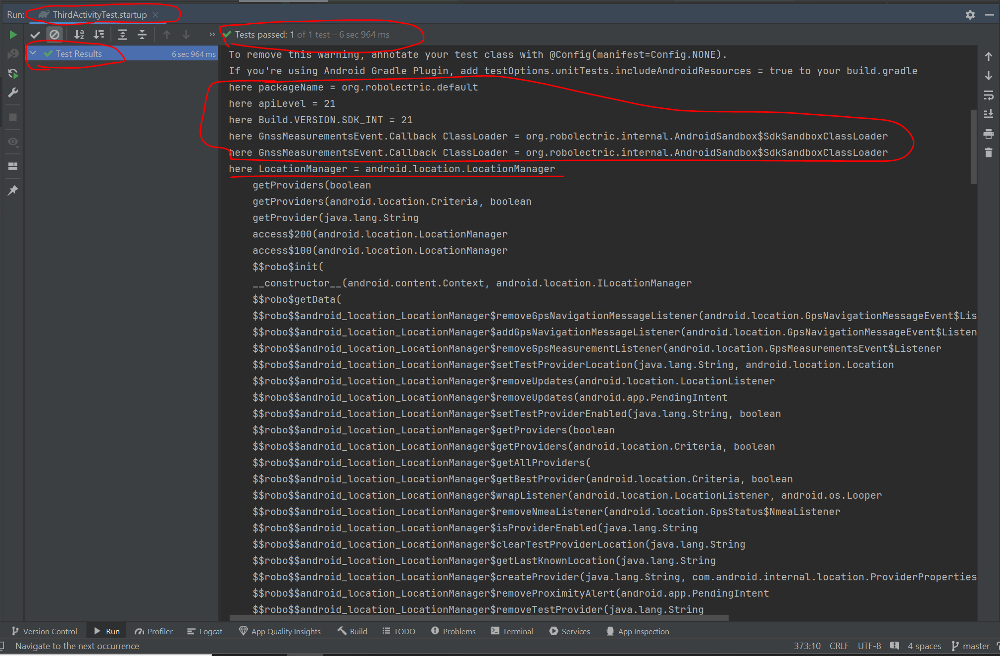

# Play with how Robolectric works concerned with shadows has type from higher API running in lower sdk

## Setup

Use super high compileSdk, targetSdk

```
android {
  namespace = "com.example.testlocationmanager3"
  compileSdk = 34                 # highest API level available

  defaultConfig {
    applicationId = "com.example.testlocationmanager3"
    minSdk = 21 
    targetSdk = 34                # highest API level available
    versionCode = 1
    versionName = "1.0"
  }
  ...
}
```

## Run

I removed dependencies on **androidx.XXXXX**, and the app successfully ran on my Pixel Android 12, API 31.

<figure>
    
    <figcaption>Running on Android 12, API 31</figcaption>
</figure>

## FirstActivity and FirstActivityTest

```java
public class FirstActivity extends android.app.Activity {

  LocationManager locationManager;

  @Override
  protected void onCreate(Bundle savedInstanceState) {
    super.onCreate(savedInstanceState);
    locationManager = (LocationManager) getSystemService(Context.LOCATION_SERVICE);
  }
}
```

And following unit test code

```java
@RunWith(RobolectricTestRunner.class)
public class FirstActivityTest {

  @Test
  public void startup() {
    System.out.println("here packageName = " + RuntimeEnvironment.application.getPackageName());
    System.out.println("here apiLevel = " + RuntimeEnvironment.getApiLevel()); // output is "21"
    System.out.println("here Build.VERSION.SDK_INT = " + Build.VERSION.SDK_INT);  // output is "21"
    FirstActivity activity = Robolectric.setupActivity(FirstActivity.class);

    assertNotNull(activity.locationManager); // test passed here.


    GnssMeasurementsEvent.Callback a = new GnssMeasurementsEvent.Callback() {
      @Override
      public void onGnssMeasurementsReceived(GnssMeasurementsEvent eventArgs) {
        super.onGnssMeasurementsReceived(eventArgs);
      }

      @Override
      public void onStatusChanged(int status) {
        super.onStatusChanged(status);
      }
    };
    System.out.println("here GnssMeasurementsEvent.Callback ClassLoader = " + a.getClass().getClassLoader().getClass().getName());
  }

  @Config(sdk = {22})
  @Test
  public void startup_config22() {
    System.out.println("here packageName = " + RuntimeEnvironment.application.getPackageName());
    System.out.println("here apiLevel = " + RuntimeEnvironment.getApiLevel()); // output is "22"
    System.out.println("here Build.VERSION.SDK_INT = " + Build.VERSION.SDK_INT);  // output is "22"
    FirstActivity activity = Robolectric.setupActivity(FirstActivity.class);

    assertNotNull(activity.locationManager);  // test passed here.

    GnssMeasurementsEvent.Callback a = new GnssMeasurementsEvent.Callback() {
      @Override
      public void onGnssMeasurementsReceived(GnssMeasurementsEvent eventArgs) {
        super.onGnssMeasurementsReceived(eventArgs);
      }

      @Override
      public void onStatusChanged(int status) {
        super.onStatusChanged(status);
      }
    };
    System.out.println("here GnssMeasurementsEvent.Callback ClassLoader = " + a.getClass().getClassLoader().getClass().getName());
  }

  @Config(sdk = {23})
  @Test
  public void startup_config23() {
    System.out.println("here packageName = " + RuntimeEnvironment.application.getPackageName());
    System.out.println("here apiLevel = " + RuntimeEnvironment.getApiLevel());  // output is "23"
    System.out.println("here Build.VERSION.SDK_INT = " + Build.VERSION.SDK_INT);  // output is "23"
    FirstActivity activity = Robolectric.setupActivity(FirstActivity.class);

    assertNotNull(activity.locationManager);  // test passed here.

    GnssMeasurementsEvent.Callback a = new GnssMeasurementsEvent.Callback() {
      @Override
      public void onGnssMeasurementsReceived(GnssMeasurementsEvent eventArgs) {
        super.onGnssMeasurementsReceived(eventArgs);
      }

      @Override
      public void onStatusChanged(int status) {
        super.onStatusChanged(status);
      }
    };
    System.out.println("here GnssMeasurementsEvent.Callback ClassLoader = " + a.getClass().getClassLoader().getClass().getName());
  }

  @Config(sdk = {24})
  @Test
  public void startup_config24() {
    System.out.println("here packageName = " + RuntimeEnvironment.application.getPackageName());
    System.out.println("here apiLevel = " + RuntimeEnvironment.getApiLevel());  // output is "23"
    System.out.println("here Build.VERSION.SDK_INT = " + Build.VERSION.SDK_INT);  // output is "24"
    FirstActivity activity = Robolectric.setupActivity(FirstActivity.class);

    assertNotNull(activity.locationManager); // test passed here.

    GnssMeasurementsEvent.Callback a = new GnssMeasurementsEvent.Callback() {
      @Override
      public void onGnssMeasurementsReceived(GnssMeasurementsEvent eventArgs) {
        super.onGnssMeasurementsReceived(eventArgs);
      }

      @Override
      public void onStatusChanged(int status) {
        super.onStatusChanged(status);
      }
    };
    System.out.println("here GnssMeasurementsEvent.Callback ClassLoader = " + a.getClass().getClassLoader().getClass().getName());
  }

  @Config(sdk = {26})
  @Test
  public void startup_config26() {
    System.out.println("here packageName = " + RuntimeEnvironment.application.getPackageName());
    System.out.println("here apiLevel = " + RuntimeEnvironment.getApiLevel());  // output is "26"
    System.out.println("here Build.VERSION.SDK_INT = " + Build.VERSION.SDK_INT);  // output is "26"
    FirstActivity activity = Robolectric.setupActivity(FirstActivity.class);

    assertNotNull(activity.locationManager); // test passed here.

    GnssMeasurementsEvent.Callback a = new GnssMeasurementsEvent.Callback() {
      @Override
      public void onGnssMeasurementsReceived(GnssMeasurementsEvent eventArgs) {
        super.onGnssMeasurementsReceived(eventArgs);
      }

      @Override
      public void onStatusChanged(int status) {
        super.onStatusChanged(status);
      }
    };
    System.out.println("here GnssMeasurementsEvent.Callback ClassLoader = " + a.getClass().getClassLoader().getClass().getName());
  }
}
```

### FirstActivityTest#startup

<figure>
    
</figure>

### FirstActivityTest#startup_config22

<figure>
    
</figure>

### FirstActivityTest#startup_config23

<figure>
    
</figure>

### FirstActivityTest#startup_config24

<figure>
    
</figure>

### FirstActivityTest#startup_config26

<figure>
    
</figure>


## SecondActivity and SecondActivityTest

```java
public class SecondActivity extends android.app.Activity {

  LocationManager locationManager;

  @Override
  protected void onCreate(Bundle savedInstanceState) {
    super.onCreate(savedInstanceState);
    locationManager = (LocationManager) getSystemService(Context.LOCATION_SERVICE);
  }

  @SuppressWarnings("NewApi")
  public void registerGns(GnssMeasurementsEvent.Callback callback) {
    // Do nothing.
  }
}
```

And following unit test code

```java
@RunWith(RobolectricTestRunner.class)
public class SecondActivityTest {

  @Config(sdk = {21})
  @Test
  public void startup() {
    System.out.println("here packageName = " + RuntimeEnvironment.application.getPackageName());
    System.out.println("here apiLevel = " + RuntimeEnvironment.getApiLevel()); // output is "21"
    System.out.println("here Build.VERSION.SDK_INT = " + Build.VERSION.SDK_INT);  // output is "21"
    SecondActivity activity = Robolectric.setupActivity(SecondActivity.class);

    assertNotNull(activity.locationManager); // test passed here.

    GnssMeasurementsEvent.Callback a = new GnssMeasurementsEvent.Callback() {
      @Override
      public void onGnssMeasurementsReceived(GnssMeasurementsEvent eventArgs) {
        super.onGnssMeasurementsReceived(eventArgs);
      }

      @Override
      public void onStatusChanged(int status) {
        super.onStatusChanged(status);
      }
    };
    System.out.println("here GnssMeasurementsEvent.Callback ClassLoader = " + a.getClass().getClassLoader().getClass().getName());

    activity.registerGns(new GnssMeasurementsEvent.Callback() {
      @Override
      public void onGnssMeasurementsReceived(GnssMeasurementsEvent eventArgs) {
        super.onGnssMeasurementsReceived(eventArgs);
      }
    });

    System.out.println("here LocationManager = " + gatherAllDeclaredMethods(activity.locationManager.getClass()));
    System.out.println("here ShadowLocationManager = " + gatherAllDeclaredMethods(shadowOf(activity.locationManager).getClass()));
  }

  private String gatherAllDeclaredMethods(Class<?> clazz) {
    StringBuilder sb = new StringBuilder(clazz.getName()).append("\n");
    for (Method method : clazz.getDeclaredMethods()) {
      sb.append("\t").append(method.getName()).append("(").append(Arrays.stream(method.getParameterTypes()).map(new Function<Class<?>, String>() {
        @Override
        public String apply(Class<?> aClass) {
          return aClass.getName();
        }
      }).collect(Collectors.joining(", "))).append("\n");
    }
    return sb.toString();
  }
}
```

### SecondActivityTest#startup

<figure>
    
</figure>
<figure>
    
</figure>
<figure>
    
</figure>

## ThirdActivity and ThirdActivityTest

```java
public class ThirdActivity extends android.app.Activity {

  @SuppressWarnings("NewApi")
  public static GnssMeasurementsEvent.Callback CALLBACK = new GnssMeasurementsEvent.Callback() {
    @Override
    public void onGnssMeasurementsReceived(GnssMeasurementsEvent eventArgs) {
      super.onGnssMeasurementsReceived(eventArgs);
    }
  };

  LocationManager locationManager;

  @Override
  protected void onCreate(Bundle savedInstanceState) {
    super.onCreate(savedInstanceState);
    locationManager = (LocationManager) getSystemService(Context.LOCATION_SERVICE);
  }
}
```

And following unit test code

```java
@RunWith(RobolectricTestRunner.class)
public class ThirdActivityTest {

  @Config(sdk = {21})
  @Test
  public void startup() {
    System.out.println("here packageName = " + RuntimeEnvironment.application.getPackageName());
    System.out.println("here apiLevel = " + RuntimeEnvironment.getApiLevel()); // output is "21"
    System.out.println("here Build.VERSION.SDK_INT = " + Build.VERSION.SDK_INT);  // output is "21"
    ThirdActivity activity = Robolectric.setupActivity(ThirdActivity.class);

    assertNotNull(activity.locationManager); // test passed here.

    GnssMeasurementsEvent.Callback a = new GnssMeasurementsEvent.Callback() {
      @Override
      public void onGnssMeasurementsReceived(GnssMeasurementsEvent eventArgs) {
        super.onGnssMeasurementsReceived(eventArgs);
      }

      @Override
      public void onStatusChanged(int status) {
        super.onStatusChanged(status);
      }
    };
    System.out.println("here GnssMeasurementsEvent.Callback ClassLoader = " + a.getClass().getClassLoader().getClass().getName());
    System.out.println("here GnssMeasurementsEvent.Callback ClassLoader = " + ThirdActivity.CALLBACK.getClass().getClassLoader().getClass().getName());
    System.out.println("here LocationManager = " + gatherAllDeclaredMethods(activity.locationManager.getClass()));
    System.out.println("here ShadowLocationManager = " + gatherAllDeclaredMethods(shadowOf(activity.locationManager).getClass()));
  }

  private String gatherAllDeclaredMethods(Class<?> clazz) {
    StringBuilder sb = new StringBuilder(clazz.getName()).append("\n");
    for (Method method : clazz.getDeclaredMethods()) {
      sb.append("\t").append(method.getName()).append("(").append(Arrays.stream(method.getParameterTypes()).map(new Function<Class<?>, String>() {
        @Override
        public String apply(Class<?> aClass) {
          return aClass.getName();
        }
      }).collect(Collectors.joining(", "))).append("\n");
    }
    return sb.toString();
  }
}
```

### ThirdActivityTest#startup

<figure>
    
</figure>
<figure>
    
</figure>

## FourthActivity and FourthActivityTest

```java
public class FourthActivity extends android.app.Activity {

  LocationManager locationManager;

  @Override
  protected void onCreate(Bundle savedInstanceState) {
    super.onCreate(savedInstanceState);
    locationManager = (LocationManager) getSystemService(Context.LOCATION_SERVICE);
  }

  @SuppressWarnings("NewApi")
  public void registerGns(GnssMeasurementsEvent.Callback callback) {
    locationManager.registerGnssMeasurementsCallback(callback, new Handler());
  }
}
```

And following unit test code

```java
@RunWith(RobolectricTestRunner.class)
public class FourthActivityTest {

  @Config(sdk = {21})
  @Test
  public void startup() {
    System.out.println("here packageName = " + RuntimeEnvironment.application.getPackageName());
    System.out.println("here apiLevel = " + RuntimeEnvironment.getApiLevel()); // output is "21"
    System.out.println("here Build.VERSION.SDK_INT = " + Build.VERSION.SDK_INT);  // output is "21"
    FourthActivity activity = Robolectric.setupActivity(FourthActivity.class);

    assertNotNull(activity.locationManager); // test passed here.

    GnssMeasurementsEvent.Callback a = new GnssMeasurementsEvent.Callback() {
      @Override
      public void onGnssMeasurementsReceived(GnssMeasurementsEvent eventArgs) {
        super.onGnssMeasurementsReceived(eventArgs);
      }

      @Override
      public void onStatusChanged(int status) {
        super.onStatusChanged(status);
      }
    };
    System.out.println("here GnssMeasurementsEvent.Callback ClassLoader = " + a.getClass().getClassLoader().getClass().getName());

    activity.registerGns(new GnssMeasurementsEvent.Callback() {
      @Override
      public void onGnssMeasurementsReceived(GnssMeasurementsEvent eventArgs) {
        super.onGnssMeasurementsReceived(eventArgs);
      }
    });

    System.out.println("here LocationManager = " + gatherAllDeclaredMethods(activity.locationManager.getClass()));
    System.out.println("here ShadowLocationManager = " + gatherAllDeclaredMethods(shadowOf(activity.locationManager).getClass()));
  }

  @Config(sdk = {26})
  @Test
  public void startup_config26() {
    System.out.println("here packageName = " + RuntimeEnvironment.application.getPackageName());
    System.out.println("here apiLevel = " + RuntimeEnvironment.getApiLevel()); // output is "21"
    System.out.println("here Build.VERSION.SDK_INT = " + Build.VERSION.SDK_INT);  // output is "21"
    FourthActivity activity = Robolectric.setupActivity(FourthActivity.class);

    assertNotNull(activity.locationManager); // test passed here.

    GnssMeasurementsEvent.Callback a = new GnssMeasurementsEvent.Callback() {
      @Override
      public void onGnssMeasurementsReceived(GnssMeasurementsEvent eventArgs) {
        super.onGnssMeasurementsReceived(eventArgs);
      }

      @Override
      public void onStatusChanged(int status) {
        super.onStatusChanged(status);
      }
    };
    System.out.println("here GnssMeasurementsEvent.Callback ClassLoader = " + a.getClass().getClassLoader().getClass().getName());

    activity.registerGns(new GnssMeasurementsEvent.Callback() {
      @Override
      public void onGnssMeasurementsReceived(GnssMeasurementsEvent eventArgs) {
        super.onGnssMeasurementsReceived(eventArgs);
      }
    });

    System.out.println("here LocationManager = " + gatherAllDeclaredMethods(activity.locationManager.getClass()));
    System.out.println("here ShadowLocationManager = " + gatherAllDeclaredMethods(shadowOf(activity.locationManager).getClass()));
  }


  private String gatherAllDeclaredMethods(Class<?> clazz) {
    StringBuilder sb = new StringBuilder(clazz.getName()).append("\n");
    for (Method method : clazz.getDeclaredMethods()) {
      sb.append("\t").append(method.getName()).append("(").append(Arrays.stream(method.getParameterTypes()).map(new Function<Class<?>, String>() {
        @Override
        public String apply(Class<?> aClass) {
          return aClass.getName();
        }
      }).collect(Collectors.joining(", "))).append("\n");
    }
    return sb.toString();
  }
}
```

### FourthActivityTest#startup

<figure>
    
</figure>

### FourthActivityTest#startup_config26

<figure>
    
</figure>
<figure>
    
</figure>
<figure>
    
</figure>

